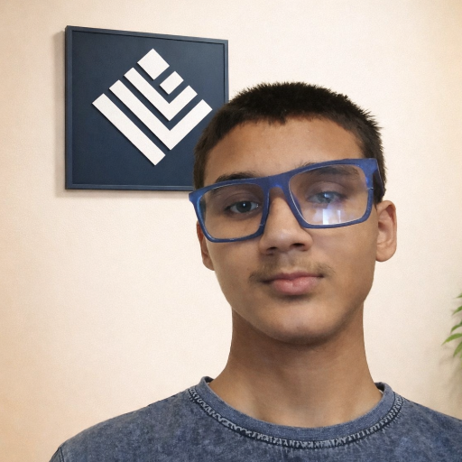

  

<!-- 👤 PROFILE IMAGE -->

  

  <a href="#">
    
    
     
    
  </a>

<h2>About Me</h2>

- 👋 Hi, I'm <b>Taraknath Karan</b>  
- 💻 Self-taught <b>Web Developer</b>  
- 🎂 Birth: <b>21-May-2009</b>  
- 👑 CEO & Creator of <b>Tarak Program</b>  
- ⚡ I build tools using <b>JavaScript</b>  
- 🔐 Learning Ethical Hacking

<a href="https://taraknath341.github.io">
   
  
</a>
<h2>Tarak Program</h2>

  

<h2>Skills</h2>

  

<h2>Links</h2>

<h2>GitHub Stats</h2>

  

  

